# 🚀 Project Management System

<div align="center">


**A modern, full-stack project management solution with React frontend and comprehensive 118-endpoint Node.js REST API**

[🌟 Live Demo](https://project-management-system-fsad.netlify.app) • [🔗 Backend API](https://project-mngmt-backend-6egk5xxe4-divyansh-jhas-projects-5f01972a.vercel.app) • [📖 Documentation](#features) • [🚀 Quick Start](#quick-start)

---


</div>

## ✨ Features

<div align="center">

|             🔐 **Authentication**             |                  👥 **Role Management**                   |          📊 **Project Tracking**          |             📋 **Task Management**             |
| :-------------------------------------------: | :-------------------------------------------------------: | :---------------------------------------: | :--------------------------------------------: |
| Secure user authentication with Supabase Auth | Admin, Manager, Developer roles with granular permissions | Real-time project creation and monitoring | Advanced task assignment and progress tracking |

|     📁 **File Management**      |      🎨 **Modern UI/UX**      |       🔒 **Security**       |       📱 **Responsive**        |
| :-----------------------------: | :---------------------------: | :-------------------------: | :----------------------------: |
| Upload and manage project files | Beautiful Tailwind CSS design | Row-level security policies | Mobile-first responsive design |

</div>

### 🎯 Core Functionality

- **🔐 Multi-Role Authentication System**

  - Secure JWT-based user registration and login
  - Role-based access control (Admin/Manager/Developer)
  - **Complete password management** (reset, change, OTP verification)
  - **Secure logout** with session management
  - Profile management with secure authentication

- **📊 Advanced Project Management**

  - Create and manage multiple projects
  - Real-time project status tracking
  - Project ownership and team collaboration

- **📋 Intelligent Task System**

  - Task creation with detailed descriptions
  - Start/end date scheduling
  - Status tracking (New → Assigned → In Progress → Completed)
  - Developer task assignments
  - **Bulk task operations** (create, update, delete unlimited tasks)
  - Advanced task filtering and search

- **👥 Team Collaboration**

  - Manager can assign tasks to developers
  - Real-time updates and notifications
  - Team member visibility and management

- **📁 File Management**
  - Upload project-related files
  - Secure file storage integration
  - File association with projects and tasks

## 🚀 Quick Start

### Prerequisites

Before you begin, ensure you have the following installed:

- **Node.js** (v16.0.0 or higher)
- **npm** or **yarn**
- **Git**

### 🔧 Installation

1. **Clone the repository**

   ```bash
   git clone https://github.com/divyanshjha30/Project-Management-System.git
   cd Project-Management-System
   ```

2. **Install dependencies**

   ```bash
   npm install
   ```

3. **Set up environment variables**

   ```bash
   # Create environment file
   touch .env.local

   # Add your backend API URL
   echo "VITE_API_URL=https://project-mngmt-backend-6egk5xxe4-divyansh-jhas-projects-5f01972a.vercel.app/api" >> .env.local
   ```

4. **Start the development server**

   ```bash
   npm run dev
   ```

5. **Open your browser**

   Navigate to `http://localhost:5173` and start managing your projects! 🎉

### 🔗 Backend Setup

This frontend requires the backend API to be running. You can either:

- **Use our hosted backend**: Already configured in the environment
- **Run locally**: Clone the [backend repository](https://github.com/divyanshjha30/Project-mngmt-Backend) and follow its setup instructions

## 🛠️ Tech Stack

<div align="center">

### Frontend


### Backend


### Tools & Libraries


</div>

### 🏗️ Architecture Overview



```mermaid
graph TB
    A[React Frontend] --> B[REST API Client]
    B --> C[Node.js Backend API]
    C --> D[JWT Authentication]
    C --> E[Supabase PostgreSQL]
    C --> F[File Storage]

    E --> G[Profiles Table]
    E --> H[Projects Table]
    E --> I[Tasks Table]
    E --> J[Task Assignments Table]
    E --> K[Files Table]

    style A fill:#61DAFB
    style C fill:#339933
    style D fill:#000000
    style E fill:#336791
```

## 📱 User Roles & Permissions

<div align="center">

| Role             | Permissions               | Dashboard Features                              |
| ---------------- | ------------------------- | ----------------------------------------------- |
| **🔑 Admin**     | Full system access        | User management, All projects, System settings  |
| **👔 Manager**   | Project & team management | Create projects, Assign tasks, Team overview    |
| **💻 Developer** | Task execution            | View assigned tasks, Update status, File access |

</div>

## 🎨 Screenshots

<details>
<summary>📸 Click to view application screenshots</summary>

### 🔐 Authentication


### 👔 Manager Dashboard


### 💻 Developer Dashboard


### 📊 Project Management


</details>

## 🚧 Database Schema

<details>
<summary>📊 View complete database structure</summary>

### 👥 Profiles Table

```sql
- user_id (UUID, PK)
- username (TEXT, UNIQUE)
- email (TEXT, UNIQUE)
- role (TEXT: ADMIN|MANAGER|DEVELOPER)
- created_at, updated_at (TIMESTAMP)
```

### 📊 Projects Table

```sql
- project_id (UUID, PK)
- project_name (TEXT)
- description (TEXT)
- owner_manager_id (UUID, FK)
- created_at, updated_at (TIMESTAMP)
```

### 📋 Tasks Table

```sql
- task_id (UUID, PK)
- project_id (UUID, FK)
- title, description (TEXT)
- start_date, end_date (DATE)
- status (TEXT: NEW|ASSIGNED|IN_PROGRESS|COMPLETED)
- created_at, updated_at (TIMESTAMP)
```

### 🔗 Task Assignments Table

```sql
- assignment_id (UUID, PK)
- task_id (UUID, FK)
- developer_id (UUID, FK)
- assigned_at (TIMESTAMP)
```

### 📁 Files Table

```sql
- file_id (UUID, PK)
- project_id (UUID, FK)
- task_id (UUID, FK, NULLABLE)
- uploaded_by_user_id (UUID, FK)
- file_name, file_path_in_storage (TEXT)
- file_size (BIGINT)
- mime_type (TEXT)
- upload_date (TIMESTAMP)
```

</details>

## 🔧 Development

### 📋 Available Scripts

| Command             | Description                              |
| ------------------- | ---------------------------------------- |
| `npm run dev`       | Start development server with hot reload |
| `npm run build`     | Build the project for production         |
| `npm run lint`      | Run ESLint for code quality              |
| `npm run preview`   | Preview the production build locally     |
| `npm run typecheck` | Type-check the TypeScript code           |

### 🌐 API Integration

This frontend connects to a comprehensive Node.js REST API backend with **118 endpoints**. Key API endpoints:

```typescript
// Enhanced Authentication (8 endpoints)
POST /api/auth/login
POST /api/auth/register
POST /api/auth/forgot-password
POST /api/auth/verify-reset-otp
POST /api/auth/reset-password
POST /api/auth/logout

// Advanced Projects (12 endpoints)
GET    /api/projects
POST   /api/projects
PUT    /api/projects/:id
DELETE /api/projects/:id
GET    /api/projects/:id/statistics
POST   /api/projects/:id/assign

// Enhanced Tasks with Bulk Operations (11 endpoints)
GET    /api/tasks
POST   /api/tasks
PUT    /api/tasks/:id
DELETE /api/tasks/:id
POST   /api/tasks/project/:id/bulk/create
PUT    /api/tasks/bulk/update
DELETE /api/tasks/bulk/delete

// User Management
GET    /api/users
PUT    /api/users/:id
```

### 🔥 **New Features Added**

- **Password Management**: Complete forgot/reset password flow with OTP
- **Bulk Task Operations**: Create, update, or delete unlimited tasks at once
- **Enhanced Security**: Comprehensive logout and session management
- **Advanced Analytics**: Project statistics and performance tracking
- **Unlimited Operations**: No restrictions on bulk task operations

### 🔑 Authentication Flow

```typescript
// Login request
const response = await fetch(`${API_URL}/auth/login`, {
  method: "POST",
  headers: { "Content-Type": "application/json" },
  body: JSON.stringify({ email, password }),
});

// Store JWT token
const { token, user } = await response.json();
localStorage.setItem("token", token);

// Use token in subsequent requests
const headers = {
  Authorization: `Bearer ${token}`,
  "Content-Type": "application/json",
};
```

### 🤝 Contributing

We welcome contributions! Please follow these steps:

1. **Fork the repository**
2. **Create a feature branch** (`git checkout -b feature/AmazingFeature`)
3. **Commit your changes** (`git commit -m 'Add some AmazingFeature'`)
4. **Push to the branch** (`git push origin feature/AmazingFeature`)
5. **Open a Pull Request**

### 📝 Code Style Guidelines

- Use **TypeScript** for type safety
- Follow **React best practices** and hooks patterns
- Use **Tailwind CSS** for styling
- Write **clean, readable code** with proper commenting
- Implement **proper error handling**
- Use **custom hooks** for API interactions

## 🐛 Troubleshooting

<details>
<summary>🔍 Common issues and solutions</summary>

### Database Connection Issues

```bash
# Check if backend API is running
curl https://project-mngmt-backend-6egk5xxe4-divyansh-jhas-projects-5f01972a.vercel.app/api/health

# Verify API URL in environment
echo $VITE_API_URL
```

### Authentication Issues

```bash
# Check if JWT token is stored
# Open browser dev tools -> Application -> Local Storage
# Look for 'token' key

# Clear authentication state
localStorage.removeItem('token');
```

### Build Errors

```bash
# Clear node modules and reinstall
rm -rf node_modules package-lock.json
npm install

# Check TypeScript errors
npm run typecheck
```

### Environment Variables

```bash
# Ensure .env.local exists and contains:
VITE_API_URL=https://project-mngmt-backend-6egk5xxe4-divyansh-jhas-projects-5f01972a.vercel.app/api
```

</details>

## 📄 License

This project is licensed under the **MIT License** - see the [LICENSE](LICENSE) file for details.

## 🙏 Acknowledgments

- **React Team** for the amazing React library
- **TypeScript** for bringing type safety to JavaScript
- **Tailwind CSS** for the utility-first CSS framework
- **Vite** for the lightning-fast build tool
- **Lucide** for the beautiful icon set
- **Node.js** community for the robust backend ecosystem

## 📞 Support

<div align="center">

**Need help? We're here for you!**

[](https://github.com/divyanshjha30/Project-Management-System/issues)
[](https://project-mngmt-backend-6egk5xxe4-divyansh-jhas-projects-5f01972a.vercel.app/api/docs)
[](mailto:your-email@example.com)

</div>

---

<div align="center">

**Made with ❤️ by [Divyansh Jha](https://github.com/divyanshjha30)**

⭐ **Star this repository if you found it helpful!** ⭐

</div>
