# 🚀 Enterprise Project Management System Frontend

<div align="center">


**Enterprise-grade React frontend for comprehensive project management system with 109 backend API endpoints across 12 functional modules**

[🌟 Live Demo](https://project-management-system-fsad.netlify.app) • [🔗 Backend API](https://project-management-system-backend-service.vercel.app) • [📖 API Documentation](https://project-management-system-backend-service.vercel.app/api/docs) • [🎨 Swagger UI](https://project-management-system-backend-service.vercel.app/api/swagger)

---


</div>

## 🎯 Enterprise Project Management Goals & Status

### 📋 **Complete Enterprise Implementation Achieved**

| **Core Requirement**    | **Status**  | **Backend APIs** | **Implementation**                                                        |
| ----------------------- | ----------- | ---------------- | ------------------------------------------------------------------------- |
| **Dashboard Homepage**  | ✅ Complete | 12 endpoints     | Role-based dashboards with comprehensive analytics and real-time metrics  |
| **Project Management**  | ✅ Complete | 12 endpoints     | Full lifecycle management with team coordination and progress tracking    |
| **Task System**         | ✅ Complete | 14 endpoints     | Advanced task management with subtasks, dependencies, and bulk operations |
| **Work Tracking**       | ✅ Complete | 12 endpoints     | Comprehensive time logging, estimates, and performance analytics          |
| **Team Management**     | ✅ Complete | 10 endpoints     | Complete team creation, member management, and performance tracking       |
| **File Management**     | ✅ Complete | 8 endpoints      | Secure file uploads, document sharing, and profile photo management       |
| **User Administration** | ✅ Complete | 8 endpoints      | Complete admin panel with user management and system administration       |
| **Authentication**      | ✅ Complete | 9 endpoints      | Comprehensive auth system with OTP verification and password management   |
| **Calendar System**     | ✅ Complete | 8 endpoints      | Holiday management, scheduling, deadlines, and meeting coordination       |
| **Analytics & Reports** | ✅ Complete | 6 endpoints      | Advanced analytics, custom reports, and performance insights              |

### 👥 **Complete User Role Implementation**

| **Role**         | **Dashboard Features**             | **API Access**                        | **Management Capabilities**                  |
| ---------------- | ---------------------------------- | ------------------------------------- | -------------------------------------------- |
| **🔑 Admin**     | System overview & user management  | Full access to all 109 endpoints      | Complete system control and configuration    |
| **👔 Manager**   | Project creation & team management | Project and team management endpoints | Create projects, assign tasks, monitor teams |
| **💻 Developer** | Task execution & progress tracking | Task and work log endpoints           | Complete assigned work and track progress    |

### 🏆 **Enterprise System Statistics**

- **109 API Endpoints** across 12 functional modules
- **Complete authentication** with email OTP verification
- **Advanced work tracking** with time logs and accuracy analytics
- **Team collaboration** tools with performance metrics
- **Secure file management** with profile photo support
- **Calendar integration** with holiday and deadline management
- **Comprehensive analytics** with custom reporting capabilities
- **Interactive documentation** with Swagger UI and comprehensive examples

## ✨ Comprehensive Enterprise Features

<div align="center">

|             🔐 **Advanced Authentication**              |                   👥 **Role Management**                   |          📊 **Project Analytics**          |               📋 **Task Management**                |
| :-----------------------------------------------------: | :--------------------------------------------------------: | :----------------------------------------: | :-------------------------------------------------: |
| JWT auth with email OTP verification and password reset | Admin, Manager, Developer with granular permissions system | Real-time analytics with custom dashboards | Advanced task system with subtasks and dependencies |

|       📁 **File Management**       |          🎨 **Modern UI/UX**           |             🔒 **Enterprise Security**             |          📱 **Responsive Design**          |
| :--------------------------------: | :------------------------------------: | :------------------------------------------------: | :----------------------------------------: |
| Secure uploads with profile photos | Beautiful Tailwind CSS with dark theme | Row-level security with comprehensive audit trails | Mobile-first responsive across all devices |

</div>

### 🎯 **Enterprise-Grade Core Functionality**

- **🔐 Complete Authentication System**

  - Secure email-based OTP verification for registration
  - JWT-based authentication with automatic token refresh
  - Comprehensive password reset system with secure token validation
  - Role-based access control (Admin/Manager/Developer)
  - Professional HTML email templates for all user communications
  - Automatic login flow after successful email verification

- **📊 Advanced Project Management**

  - Create and manage multiple projects with detailed analytics
  - Real-time project status tracking with timeline visualization
  - Project ownership with comprehensive team collaboration tools
  - Resource allocation and workload balancing
  - Project milestone and deadline management

- **📋 Comprehensive Task System**

  - Advanced task creation with detailed descriptions and dependencies
  - Subtask support for granular work breakdown
  - Start/end date scheduling with calendar integration
  - Multi-status workflow (New → Assigned → In Progress → Completed → Blocked)
  - Bulk task operations for efficient management
  - Task estimation and actual time tracking

- **⏰ Work Logging & Analytics**

  - Detailed time tracking with work log entries
  - Performance analytics and productivity metrics
  - Estimation accuracy tracking and improvement suggestions
  - Team productivity insights and reporting
  - Custom work log categories and billing integration

- **👥 Advanced Team Collaboration**

  - Team creation and member management tools
  - Manager assignment of tasks to developers
  - Real-time updates and notification system
  - Team performance statistics and reviews
  - Workload balancing and capacity planning
  - Skill tracking and development paths

- **📁 Enterprise File Management**

  - Secure file upload and storage integration
  - Project and task-specific file organization
  - Profile photo management with history tracking
  - Document version control and sharing permissions
  - File search and advanced filtering capabilities

- **📅 Calendar & Scheduling Integration**

  - Holiday calendar management system
  - Task deadline and milestone tracking
  - Meeting coordination and scheduling
  - Deadline reminder system with notifications
  - Project timeline visualization

- **📈 Advanced Analytics & Reporting**
  - Real-time dashboard metrics for all user roles
  - Custom report generation with export capabilities
  - Performance trend analysis and insights
  - Team productivity benchmarking
  - Resource utilization tracking and optimization

## 🚀 Quick Start

### Prerequisites

Before you begin, ensure you have the following installed:

- **Node.js** (v16.0.0 or higher)
- **npm** or **yarn**
- **Git**

### 🔧 Installation

1. **Clone the repository**

   ```bash
   git clone https://github.com/divyanshjha30/Project-Management-System.git
   cd Project-Management-System
   ```

2. **Install dependencies**

   ```bash
   npm install
   ```

3. **Set up environment variables**

   ````bash
   # Create environment file
   touch .env.local

   # Add your configuration (replace with your actual Supabase anon key):
   echo "VITE_API_URL=https://project-management-system-backend-service.vercel.app/api" >> .env.local
   echo "VITE_SUPABASE_URL=https://desltpchhyehrfsedgen.supabase.co" >> .env.local
   echo "VITE_SUPABASE_ANON_KEY=your_supabase_anon_key" >> .env.local
   ```4. **Start the development server**

   ```bash
   npm run dev
   ````

4. **Open your browser**

   Navigate to `http://localhost:5173` and start managing your projects! 🎉

### 🔗 Backend Setup

This frontend requires the backend API to be running. You can either:

- **Use our hosted backend**: Already configured in the environment
- **Run locally**: Clone the [backend repository](https://github.com/divyanshjha30/Project-mngmt-Backend) and follow its setup instructions

## 🛠️ Tech Stack

<div align="center">

### Frontend


### Backend


### Tools & Libraries


</div>

### 🏗️ Architecture Overview



```mermaid
graph TB
    A[React Frontend] --> B[REST API Client]
    B --> C[Node.js Backend API]
    C --> D[JWT Authentication]
    C --> E[Supabase PostgreSQL]
    C --> F[File Storage]

    E --> G[Profiles Table]
    E --> H[Projects Table]
    E --> I[Tasks Table]
    E --> J[Task Assignments Table]
    E --> K[Files Table]

    style A fill:#61DAFB
    style C fill:#339933
    style D fill:#000000
    style E fill:#336791
```

## 📱 User Roles & Permissions

<div align="center">

| Role             | Permissions               | Dashboard Features                              |
| ---------------- | ------------------------- | ----------------------------------------------- |
| **🔑 Admin**     | Full system access        | User management, All projects, System settings  |
| **👔 Manager**   | Project & team management | Create projects, Assign tasks, Team overview    |
| **💻 Developer** | Task execution            | View assigned tasks, Update status, File access |

</div>

## 🎨 Screenshots

<details>
<summary>📸 Click to view application screenshots</summary>

### 🔐 Authentication


### 👔 Manager Dashboard


### 💻 Developer Dashboard


### 📊 Project Management


</details>

## 🚧 Database Schema

<details>
<summary>📊 View complete database structure</summary>

### 👥 Profiles Table

```sql
- user_id (UUID, PK)
- username (TEXT, UNIQUE)
- email (TEXT, UNIQUE)
- role (TEXT: ADMIN|MANAGER|DEVELOPER)
- created_at, updated_at (TIMESTAMP)
```

### 📊 Projects Table

```sql
- project_id (UUID, PK)
- project_name (TEXT)
- description (TEXT)
- owner_manager_id (UUID, FK)
- created_at, updated_at (TIMESTAMP)
```

### 📋 Tasks Table

```sql
- task_id (UUID, PK)
- project_id (UUID, FK)
- title, description (TEXT)
- start_date, end_date (DATE)
- status (TEXT: NEW|ASSIGNED|IN_PROGRESS|COMPLETED)
- created_at, updated_at (TIMESTAMP)
```

### 🔗 Task Assignments Table

```sql
- assignment_id (UUID, PK)
- task_id (UUID, FK)
- developer_id (UUID, FK)
- assigned_at (TIMESTAMP)
```

### 📁 Files Table

```sql
- file_id (UUID, PK)
- project_id (UUID, FK)
- task_id (UUID, FK, NULLABLE)
- uploaded_by_user_id (UUID, FK)
- file_name, file_path_in_storage (TEXT)
- file_size (BIGINT)
- mime_type (TEXT)
- upload_date (TIMESTAMP)
```

</details>

## 🔧 Development

### 📋 Available Scripts

| Command             | Description                              |
| ------------------- | ---------------------------------------- |
| `npm run dev`       | Start development server with hot reload |
| `npm run build`     | Build the project for production         |
| `npm run lint`      | Run ESLint for code quality              |
| `npm run preview`   | Preview the production build locally     |
| `npm run typecheck` | Type-check the TypeScript code           |

### 🔗 **Backend API Integration**

This frontend connects to a comprehensive Node.js REST API backend with 109 endpoints across 12 modules:

```typescript
// Complete API Modules (109 endpoints total)

// 🔐 Authentication & Security (9 endpoints)
POST /api/auth/register         // Registration with OTP
POST /api/auth/verify-otp       // Email verification
POST /api/auth/resend-otp       // Resend verification
POST /api/auth/login            // User authentication
POST /api/auth/forgot-password  // Password reset request
POST /api/auth/verify-reset-otp // Reset token verification
POST /api/auth/reset-password   // Complete password reset
POST /api/auth/change-password  // Change password
POST /api/auth/logout           // Session termination

// 📋 Project Management (12 endpoints)
GET    /api/projects                    // List projects
POST   /api/projects                    // Create project
GET    /api/projects/:id               // Get project details
PUT    /api/projects/:id               // Update project
DELETE /api/projects/:id               // Delete project
POST   /api/projects/:id/assign        // Assign team members
GET    /api/projects/dashboard          // Project analytics
GET    /api/projects/developers         // Available developers
GET    /api/projects/:id/statistics     // Project metrics
GET    /api/projects/:id/timeline       // Project timeline
PUT    /api/projects/:id/status         // Update status
GET    /api/projects/:id/members        // Team members

// ✅ Advanced Task System (14 endpoints)
GET    /api/tasks                       // User tasks
GET    /api/tasks/project/:id          // Project tasks
POST   /api/tasks                      // Create task
GET    /api/tasks/:id                  // Task details
PUT    /api/tasks/:id                  // Update task
DELETE /api/tasks/:id                  // Delete task
POST   /api/tasks/:id/assign           // Assign developers
POST   /api/tasks/:id/unassign         // Remove assignments
GET    /api/tasks/:id/statistics       // Task metrics
POST   /api/tasks/bulk/create          // Bulk creation
PUT    /api/tasks/bulk/update          // Bulk updates
DELETE /api/tasks/bulk/delete          // Bulk deletion
GET    /api/tasks/search               // Advanced search
GET    /api/tasks/dependencies         // Dependencies

// 🔧 Subtask Management (8 endpoints)
GET    /api/subtasks/task/:id          // Task subtasks
POST   /api/subtasks/task/:id          // Create subtask
GET    /api/subtasks/:id               // Subtask details
PUT    /api/subtasks/:id               // Update subtask
DELETE /api/subtasks/:id               // Delete subtask
POST   /api/subtasks/:id/complete      // Mark complete
GET    /api/subtasks/user              // User subtasks
GET    /api/subtasks/:id/statistics    // Subtask metrics

// ⏰ Work Log Management (12 endpoints)
GET    /api/work-logs                  // User work logs
GET    /api/work-logs/task/:id         // Task work logs
POST   /api/work-logs                  // Create work log
GET    /api/work-logs/:id              // Work log details
PUT    /api/work-logs/:id              // Update work log
DELETE /api/work-logs/:id              // Delete work log
GET    /api/work-logs/user/:id         // User's work logs
GET    /api/work-logs/statistics       // Work statistics
POST   /api/work-logs/bulk/create      // Bulk creation
PUT    /api/work-logs/bulk/update      // Bulk updates
DELETE /api/work-logs/bulk/delete      // Bulk deletion
GET    /api/work-logs/analytics        // Analytics

// 👥 Team Management (10 endpoints)
// 📅 Calendar System (8 endpoints)
// 📈 Analytics & Reporting (6 endpoints)
// 📁 File Management (8 endpoints)
// 👑 Admin Functions (8 endpoints)
// 📊 Estimation System (9 endpoints)
// ... and more
```

### 🔑 Authentication & OTP Flow

```typescript
// Step 1: Register user and send OTP
const registerResponse = await fetch(`${API_URL}/auth/register`, {
  method: "POST",
  headers: { "Content-Type": "application/json" },
  body: JSON.stringify({
    username: "john_doe",
    email: "john@example.com",
    password: "password123",
    role: "DEVELOPER",
  }),
});
// Response: { message: "OTP sent to your email...", tempUserId: "..." }

// Step 2: User receives email with 6-digit OTP, then verifies
const verifyResponse = await fetch(`${API_URL}/auth/verify-otp`, {
  method: "POST",
  headers: { "Content-Type": "application/json" },
  body: JSON.stringify({
    email: "john@example.com",
    otp: "123456",
  }),
});
// Response: { token: "jwt_token", user: {...}, message: "Email verified successfully" }

// Step 3: User is now logged in automatically
localStorage.setItem("token", token);
```

### 🔐 Login Flow

```typescript
// Login request (only for verified users)
const response = await fetch(`${API_URL}/auth/login`, {
  method: "POST",
  headers: { "Content-Type": "application/json" },
  body: JSON.stringify({ email, password }),
});

// Store JWT token
const { token, user } = await response.json();
localStorage.setItem("token", token);

// Use token in subsequent requests
const headers = {
  Authorization: `Bearer ${token}`,
  "Content-Type": "application/json",
};
```

### 🤝 Contributing

We welcome contributions! Please follow these steps:

1. **Fork the repository**
2. **Create a feature branch** (`git checkout -b feature/AmazingFeature`)
3. **Commit your changes** (`git commit -m 'Add some AmazingFeature'`)
4. **Push to the branch** (`git push origin feature/AmazingFeature`)
5. **Open a Pull Request**

### 📝 Code Style Guidelines

- Use **TypeScript** for type safety
- Follow **React best practices** and hooks patterns
- Use **Tailwind CSS** for styling
- Write **clean, readable code** with proper commenting
- Implement **proper error handling**
- Use **custom hooks** for API interactions

## 🐛 Troubleshooting

<details>
<summary>🔍 Common issues and solutions</summary>

### Database Connection Issues

```bash
# Check if backend API is running
curl https://project-management-system-backend-service.vercel.app/api/health

# Verify API URL in environment
echo $VITE_API_URL
```

### Authentication Issues

```bash
# Check if JWT token is stored
# Open browser dev tools -> Application -> Local Storage
# Look for 'token' key

# Clear authentication state
localStorage.removeItem('token');
```

### Build Errors

```bash
# Clear node modules and reinstall
rm -rf node_modules package-lock.json
npm install

# Check TypeScript errors
npm run typecheck
```

### Environment Variables

```bash
# Check current API URL being used
# Look in browser console for: "🔗 API Base URL: ..."

# Your .env.local should contain:
VITE_API_URL=https://project-management-system-backend-service.vercel.app/api
VITE_SUPABASE_URL=https://desltpchhyehrfsedgen.supabase.co
VITE_SUPABASE_ANON_KEY=your_supabase_anon_key

# Verify environment is loaded correctly:
cat .env.local
```

</details>

## 📄 License

This project is licensed under the **MIT License** - see the [LICENSE](LICENSE) file for details.

## 🙏 Acknowledgments

- **React Team** for the amazing React library
- **TypeScript** for bringing type safety to JavaScript
- **Tailwind CSS** for the utility-first CSS framework
- **Vite** for the lightning-fast build tool
- **Lucide** for the beautiful icon set
- **Node.js** community for the robust backend ecosystem

## 📞 Support

<div align="center">

**Need help? We're here for you!**

[](https://github.com/divyanshjha30/Project-Management-System/issues)
[](https://project-management-system-backend-service.vercel.app/api/docs)
[](mailto:your-email@example.com)

</div>

---

<div align="center">

**Made with ❤️ by [Divyansh Jha](https://github.com/divyanshjha30)**

⭐ **Star this repository if you found it helpful!** ⭐

</div>
